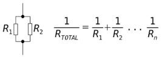
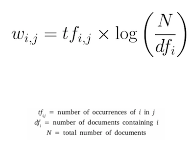

# Week 8 Exercises
*Exercises for Week 8 of Computing 1 for the Dyson School of Design Engineering at Imperial College London.*

## Using and Editing a Class

Resistors are electrical components used in just about all basic circuits. They are measured in Ohms and come packaged in different values. Their values are encoded on them as coloured stripes which can be used to compute the target resistance of the resistory +/- a percentage tolerance. The web is full of calculators that determine the value for you, such as [this one by Digi-Key](https://www.digikey.co.uk/en/resources/conversion-calculators/conversion-calculator-resistor-color-code-4-band).

Read through the `resistor.py` file which is the start of a class representing a signal resistor.

1. In an interactive Python shell or by creating and running a new Python file, create two different instances of `Resistor` with colours `brown black red silver` and `red red red brown gold`. Call the `value()` method for each and print their resistances.

2. Edit the `__init__` method of the `Resistor` class so that the strings passed as input arguments are all lowercase. In other words, if someone enters `Red` as a colour string, it will be changed to `red` to match the attribute. 

3. Finish the two methods that have been started in the file, `min_value()` and `max_value()` so that they return the minimum and maximum values that a resistor with a defined set of colours can be with the given tolerances.

4. Create a file called `parallel.py` which contains a method called `parallel_pair()` that takes in two instances of a resistor and returns the resistance value of them in a parallel circuit. The equation for calculating the resistance of two resistors in parallel is:



For example, you would call the function with the following code:

```
my_resistor1 = Resistor('red', 'red', 'brown', 'gold')
my_resistor2 = Resistor('yellow', 'orange', 'black', 'silver')
total_resistance = parallel_pair(my_resistor1, my_resistor2)
```

5. This an extra challenging exercise: add another method called `parallel_resistance()` that takes an arbitray number of arguments, each an instance of `Resistor`, and returns the resistance value of the resulting parallel circuit using the same equation shown above. Look into a Python concept called arbitrary arguments. It's described in detail starting on page 554 of Learning Python by Lutz.


## Creating a New Class

Let's start the code for how you might design a system to manage DesEng students using materials in a making space. We will create a class to represent a single student, assigning them a starting budget along with capturing some basic information. We will then add a helper method to deduct an amount of money of their budget and three methods each which call the helper method to deduct a specific cost.

1. Create a file in the same folder as this README file called `student.py`

2. Within that file create a class called `DEStudent`. The constructor sets the following attributes using keyword arguments:

    * `name` (string)
    * `year` (integer)
    * `budget` (float)

    For example, you might create an instance the following student when using this class:
    
    `my_student = DEStudent(name='Peter Cheung', year=3, budget=100)`

3. Add a method called `summary()` that returns a formatted string with the student information. 

    For example:
    
    `my_student.summary()`

    Would return:
    `Peter Cheung (DE3) with £100 remaining`

4. Add a method called `spend()` that deducts from the budget the amount specified in the argument and returns the amount remaining in the budget. If the requested amount to spend is more than the remaining budget, then raise a `ValueError` exception.

    For example, if the remaining budget was £100:

    `my_student.spend(3.50)`

    Would return:
    `96.5`

5. Add three methods `three_d()`, `paper_print()`, and `laser_cut()` that each call `spend()` to deduct a specific amount from the budget. Each method takes a single input (a quantity of units), and for each unit the following is deducted from the budget:

    * `three_d()` - one unit costs £5.50
    * `paper_print()` - one unit costs £0.10
    * `laser_cut()` - one unit costs £1.00


## Navigating the File System

1. In an interactive Python shell (not the general terminal command line, but interacting with the Python interpreter), print out the list of files and folders in the folder where this README is located. (Should be the same as when you type `ls` on the command line. You should do this from the [built-in OS library](https://docs.python.org/3.8/library/os.html).)

2. Either in the interactive shell or in a Python file if you want to save it, loop through the content of the folder `text_files` and print out the name of each file in the folder.


## Opening and Adding to a Text File

1. Write a Python script that opens the file `mercutio.txt` in the folder `text-files` and prints the first 10 lines. Pay attention to using good practice and using the `with` keyword as [described in the Python documentation](https://docs.python.org/3/tutorial/inputoutput.html#reading-and-writing-files_).

2. Open the `christmas-carol.txt` file in the `text-files` folder and rewrite the ending. Remove the last set of paragraphs and replace the text with a new ending where Scrooge did not learn any lessons. Write out your new ending to the text file and then open it in a text editor to verify that your changes worked.


## Creating a New Text File

1. Write a Python script that creates a new file named the current time and date ([see the `time` module](https://docs.python.org/3/library/time.html)) which contains a description of what you will do over the December break and saves the file in the `text-files` folder (located in the same folder as this `README`).

## Putting Code Into Context - Natural Language Processing

When automatically analysing a text file to try and identify important concepts within text, perhaps as part of [Natural Language Processing](https://becominghuman.ai/a-simple-introduction-to-natural-language-processing-ea66a1747b32) a common issue to address is how to figure out what the important keywords of a text are. There are many words that are used repeatedly in any given text, but don't usually carry with them meaningful content and can get in the way of simple statistics about the text. For example, trying to determine the most commonly used word in order to infer the topic being discussed would be useless if the word 'the' was always returned as the answer.

Term Frequency - Inverse Data Frequency (TF-IDF) is a mathematical tool often used to address this issue. This exercise - which will extend through next week - will walk you through writing Python code that will read in a textfile and compute the TF-IDF described in the below equation. There are lots of further resources about this algorithm online, [I think this one is a good place to start.](http://www.tfidf.com/)



Note that the above equation doesn't make it very clear that term frequency is the number of occurrences of a term divided by the total number of unique terms in that same document.

### TFIDF Exercise Part 1: Term Frequency
*This is a more advanced exercise than will be required on the assessment, this is just a chance to challenge yourself if you are feeling comfortable with the content so far.*

Term Frequency measures how often a word appears in a document. It is the ratio of times that a term appears in a document (for us a document will be a single text file) compared to the total number of words in that document. By following the below steps, you will create a class that is instantiated by giving it a text file location. It will then read in that file and calculate the Term Frequency for all word in the file and save that in an attribute.

1. Create a new Python file in the same folder as this README called `tf_document.py`.

2. As a first step, in your new Python file create a class called `TFDocument`. For now create a constructor (`__init__()` method) that creates an attribute called `tf` that is an empty dictionary and then returns nothing. This will just be a placeholder for now. You'll return to it later.

3. Add an input argument to `__init__()` that takes in a string that is a path to a text file. Save that string to an instance attribute called `location`.

4. Add a method to the class called `read_file()`. The method reads in the file at the path in the instance attribute `location` that you saved in the constructor and returns a string of the contents.

5. Add a method to the class called `string_to_list()` that takes in a single string and returns a list of all the words that were in that string. Make sure all whitespace is removed and all the words in the list are lowercase. You may find [looking through the string methods](https://docs.python.org/3.8/library/string.html) useful.

6. Next write a function that calculates the TF for all words in a given list of strings. Inside your class, create a function called `compute_tf()` that takes in a string and returns a dictionary where each key is a word that appears in the string and the associated value is the number of times that word appeared divided by the total number of unique words that appeared in the list.

7. Run the test file `test_tfdocument_week8.py` to check that your class works correctly.

8. Now you will change your class so that it opens, reads, and parses a file computing the TF all when just creating an instance of the class. Edit your `__init__` method in your class so that it:

    * Calls `read_file()` to read in the text.

    * Then calls `string_to_list()` to create a list of words from that text and save it in a variable.

    * And last compute the TF of the generated list that you saved in the above variable, and save the output in the `tf` attribute.

9. In the interactive shell you should now be able to import the module, create an instance of the class pointing at a particular file, and then print the attribute `tf` to see the calculated terms and their frequencies - all in three lines of code like the following.

```
import tf_document as t
my_t = t.TFDocument('./text-files/a-drinking-song-yeats.txt')
my_t.tf
```


Next week you will do Part 2 and build on this code to complete the TF-IDF computation. 

